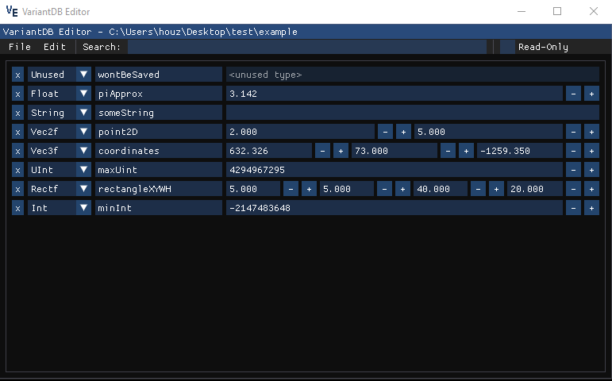

# VariantDB Editor
Simple GUI tool for viewing & editing [ProtonSDK](https://github.com/SethRobinson/proton)'s VariantDB files, such as Growtopia's save.dat file.
Written using Dear ImGui's DX11 backend. Dear ImGui is bundled with this repository. The project should compile with Visual Studio 2022 out of the box, 
just open the project file and build. A precompiled binary can be downloaded from the Releases section.

